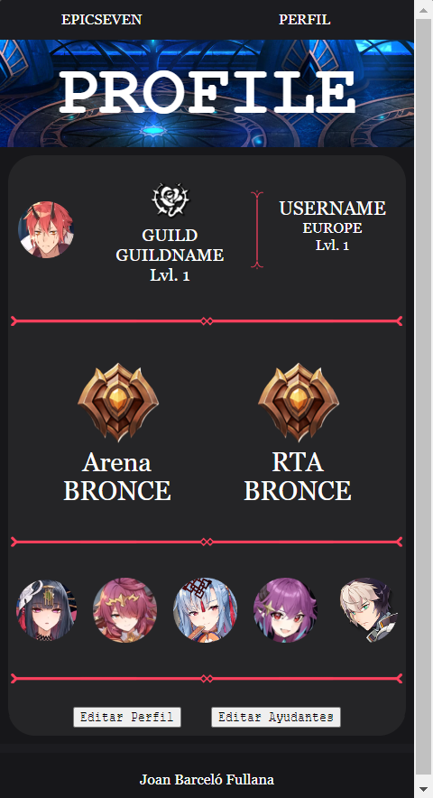
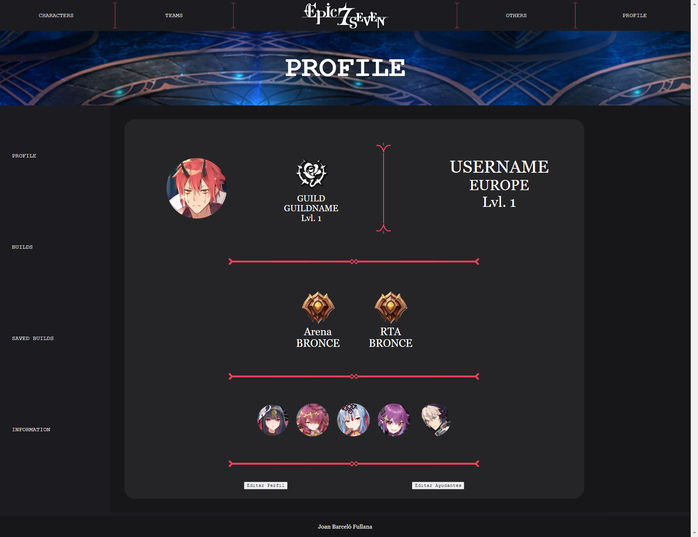
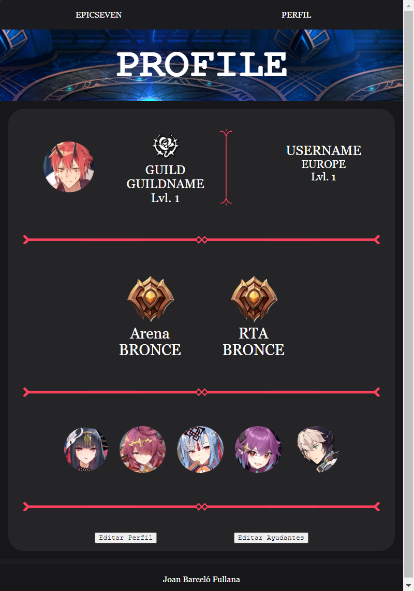
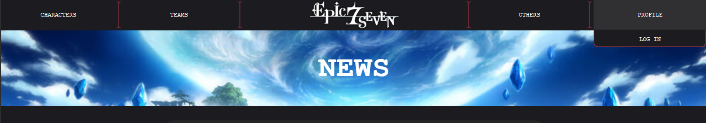
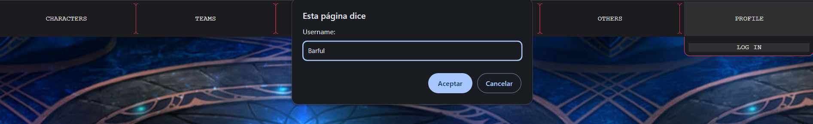
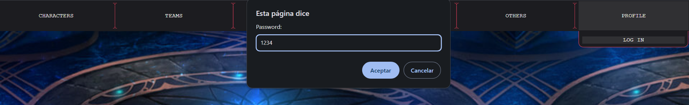
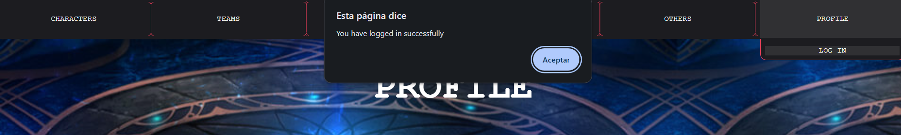
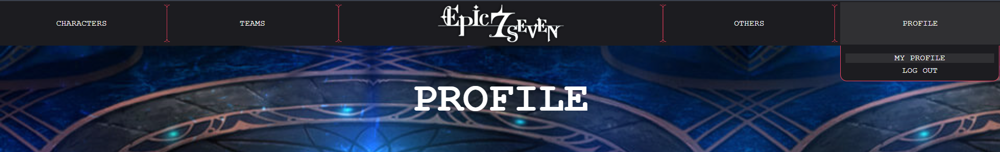

## Introducció
Aquest trimestre he continuat avançant la pàgina anterior, pero m'he centrat en un pàgina específica. Aquesta pàgina és la del [perfil de l'usuari](HTML/ProfileInicio.html).
En aquesta pàgina es mostra el perfil de l'usuari, on aques el pot personalitzar al seu gust y amb la seva informació.
## INTERACCIONS DE LA PÀGINA
Començant pel nav, ara quan pases per damunt o pitges les opcions del menú aquestes canvien el fons y et mostren just davall els submenus que té.
A la part de l'esquerra de la pàgina y ha un index per navegar entre les pàgines del perfil (les altres pàgines no estàn implementades)
Al cos de la pagina es veu el següent:
  - Informació de l'usuari
    Amb una foto de perfil, gremi, nivell del gremi, nom d'usuari, regió y nivell de l'usuari.
    Es pot modificar amb el botó d'editar perfil.
- LLiga on es troba
  Una a l'esquerra el de l'"arena", i a la dreta el de "RTA".
  Mitjançant el botó d'editar perfil es pot canviar la lliga on estás y també s'actualitzará la imatge.
- Els ajudants
  Els ajudants són 5 fotografies.
  Aquestes es poden canviar amb el botó d'editar ajudants.
- Botons per editar
  A la part inferiror del cos es troben els dos botóns que mostren un formulari per canviar la informació.
  
  
  
- Per entrar desde la pàgina d'inci he de fer el següent:
    1. Pitjam d'amunt el botó del nav 'Profile'.
       
    3. Hem de iniciar sessió.
      - Per iniciar sessió he ho he fet amb alerts y prompts per afegirlos a la tasca.
      - El nom d'usuari es 'Barful' i la contrasenya es '1234'
        
        
        
    5. Una vegada iniciat sessió hem de pitjar damunt 'Profile' un altre pic.
       
    7. Ara sortirá el link a 'My Profile'
    8. Pitjam damunt 'My Profile'
### COSES MILLORADES
El que he millorat de la tasca anterior es el tamany de les lletres que han passat de px a em.
A la part del nav també he modificat alguna cosa. 
  1. Els submenus
     -He afegit dos menus més
     - He afegit que quan pases per damunt d'un dels menus del nav, aquest desplegui la seva llista de submenús
  2. Media Querries
     - La pàgina d'antes no tenia media querry del nav, perquè hi cabia en tamany de movil, ara en tamanys perits només surten dos meuns que son el de la pàgina actual ( en aquest cas la del perfil ) y la global. També tenen submenus desplegables amb tot el contingut

# APARTATS DE LA TASCA
## Formulari de Contacte Interactiu
### Crea un formulari de contacte
En aquest punt he creat un formulari per modificar el teu perfil. Quan pitges el botó d'editar perfil s'obri un formular que et demana la informació que vols que tengui el teu perfil. Quan envies el formulari es guarda dins un localStorage y s'actualitza la pàgina amb aquesta informació.
### S'ha d'adaptar a diferents tipus de resolucions de pantalla

### Valida tots els camps on sigui necessari per a garantir l'entrada de dades correcta abans d'enviar el formulari
- Els camps 'Guild Name' y 'User Name', només accepten 25 lletres
- El camp 'Guild Lvl' només accepta números del 0-20
- El camp 'User Lvl' només accepta números del 0-70
- Els altres camps he obtat per fer-los amb opcions per evitar que l'usuari introdueixi una data que no vull
## Scripts
### Càrrega dinàmica de contingut
- L'apartat del nav, quan hi passes per damunt mostra el submenus.
- Quan pitges damunt els botons d'editar, tant perfil com ajudants. Surt un formulari que està inicialment ocult.
### Notificacions emergents
- En el botó per editar ajudants, s'han de triar 5 personatjes. Si en tries de més o de menos la pàgina et mostra un alert et diu que n'has de triar 5
### Enquestes/Valoracions Interactives
- En el botó de editar perfil, la informació que posses al formulari es ver a la pàgina. També té un script que depenguent de la lliga on estiguis mostra l'emblema d'aquesta lliga.
- A l'apartat de triar ajudants també es canvien les imatges dels ajudants del teu perfil.
### Canvis d'estil
- El que he fet per aquest apartat és que puguis tiriar el ajudants que vulguis i es canviin al perfil.
### Imatges
- El botó de triar ajudants mostra una galeria amb diferents personatges, els quals pots triar. Cuan pases el ratolí per damunt lal imatge es difumina y surt damunt la imatge el nom del personatge. Quan selecciones un personatge aques es queda marcat amb un marc de color vermell. Es poden seleccionr y desseleccionar.

